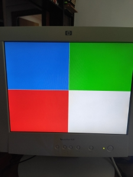

### VGA Test

Example to test VGA using iCE40Hx4K fpga. It uses one of the PLLs to generate a 25.185 MHz clock.
The resolution is of 640x480 and 60 Hz of refreshing frequency.

It uses 9 bits for pixel color generation, as the Pmod has nine pins, R(0/1/2) G(0/1/2) B(0/1/2)

The `vga_sync` modules creates the required `v_sync` and `h_sync` signals to control the display. This module also
instantiates the iCE PLL clock to create 25.185 MHz out of 12 MHz.

### Material

+ Alhambra II board
+ [VGA Pmod](https://store.digilentinc.com/pmod-vga-video-graphics-array/)
+ Jumper cables  

